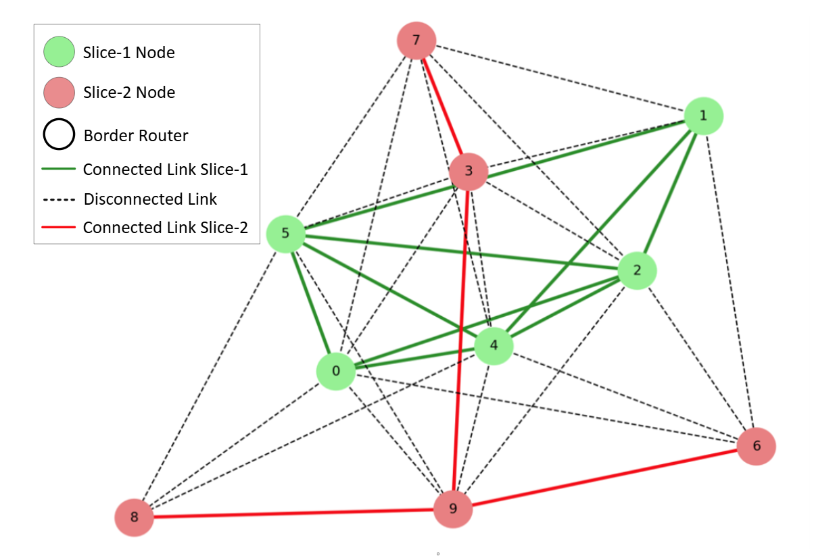

# θ-slicer (theta-slicer)
The rapid expansion and pervasive integration of Internet of Things Networks (IoTNs) into everyday applications increasingly demand deployment in high- and ultra-density topologies. These environments present significant technical and operational challenges, including communication interference, signal congestion, resource contention, and degraded quality of service (QoS). Software-Defined Networking (SDN) has emerged as a promising paradigm, centralizing network control and enabling logical or physical network-topology slicing to address these Ultra-Dense IoT (UDIoT) challenges. However, determining optimal and efficient slicing configurations remains a complex and time-consuming task, particularly when performed manually by network administrators. In this paper, we propose ϑ-Slicer, a novel heuristic algorithm that automates and optimizes the slicing decision process. Inspired by graph partitioning techniques such as Max-Cut and tailored to UDIoT requirements, ϑ-Slicer generates a topology-aware plan for assigning network nodes to ϑ connected and balanced subgraphs. The algorithm aims to maximize inter-slice edge cuts (i.e., communication links) while preserving intra-slice connectivity and achieving balanced node distribution. Adapted for practical IoT scenarios such as data harvesting, the algorithm accepts border router nodes as input parameters to guide partition anchoring. Our evaluation demonstrates its effectiveness across diverse network scenarios, showing improvements in neighbor reduction, operational speed, and partitioning integrity.

